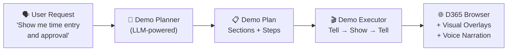
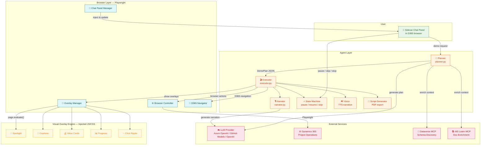

# D365 Demo Copilot

**AI-powered live demonstration agent for Dynamics 365**

[](https://opensource.org/licenses/MIT)
[](https://www.python.org/downloads/)

The D365 Demo Copilot takes customer requests in natural language, generates structured demo plans, and executes them in a live Dynamics 365 browser session with visual overlays, voice narration, and interactive controls — all through an in-browser sidecar chat panel.

Demo video: https://youtu.be/DfJVVV22tCw?si=MYX2P46hUCiuX-t7


## Key Features

| Feature | Description |
|---------|-------------|
| **Sidecar Chat Panel** | In-browser chat UI — all interaction happens in the browser, not the terminal |
| **Dynamic Demo Planning** | Describe what you want to demo and the AI generates a structured plan with sections and steps |
| **Tell-Show-Tell Pattern** | Every step follows presentation best practices: explain, demonstrate, summarize |
| **Visual Spotlight** | Dims the page and highlights the current element with a glowing ring |
| **Caption Overlays** | Movie-subtitle-style text at the bottom of the screen with typewriter animation |
| **Business Value Cards** | Callout cards with quantified metrics (e.g., "75% faster approval cycles") |
| **Voice Narration** | AI-powered text-to-speech narration (Azure, OpenAI, or browser-native) |
| **Progress Tracking** | Step counter, progress bar, and visual step timeline |
| **Pause / Resume / Skip** | Full demo control via quick-action buttons in the chat panel |
| **Script PDF Export** | Auto-generates a PDF demo script with screenshots after each demo |
| **Schema Discovery** | Connects to Dataverse MCP for live entity schema awareness |
| **MS Learn Integration** | Enriches demo plans with official Microsoft documentation |

## How It Works



The agent opens a Playwright-controlled browser, injects a sidecar chat panel, and drives D365 through each demo step with spotlights, captions, business value callouts, and progress indicators.

### Architecture Diagram



## Getting Started

### Prerequisites

- **Python 3.10+**
- **Node.js** (required by Playwright)
- **Access to a D365 environment** (CE, F&O)
- **One of** the following LLM providers:
  - Azure OpenAI endpoint + API key
  - GitHub PAT (uses GitHub Models — free for Copilot subscribers)
  - OpenAI API key

### Quick Start

```bash
# Clone the repository
git clone https://github.com/seangalliher/D365-Demo-Copilot.git
cd D365-Demo-Copilot/demo_agent

# Create virtual environment
python -m venv .venv
.venv\Scripts\Activate.ps1   # Windows
# source .venv/bin/activate  # macOS/Linux

# Install dependencies
pip install -r requirements.txt

# Install Playwright browsers
playwright install chromium

# Configure credentials
cp .env.example .env
# Edit .env with your D365 URL and LLM credentials (see Configuration below)

# Run the agent
python -m demo_agent
```

On first run, a browser window opens for you to log in to D365. Your auth state is saved for future sessions.

### Configuration

Copy `.env.example` to `.env` and configure:

```bash
# Required: Your D365 environment URL
D365_BASE_URL=https://your-org.crm.dynamics.com

# LLM Provider (pick ONE):

# Option 1 — Azure OpenAI (recommended for enterprise):
AZURE_OPENAI_ENDPOINT=https://your-resource.openai.azure.com
AZURE_OPENAI_API_KEY=sk-...

# Option 2 — GitHub Copilot (free for Copilot subscribers):
GITHUB_TOKEN=ghp_...

# Option 3 — OpenAI direct:
OPENAI_API_KEY=sk-...

# Optional: Dataverse API access (for live schema discovery + data creation)
DATAVERSE_TENANT_ID=...
DATAVERSE_CLIENT_ID=...
DATAVERSE_CLIENT_SECRET=...

# Optional: Voice narration
VOICE_ENABLED=true
VOICE_PROVIDER=auto          # auto, edge, or openai
```

> **GitHub Models bridge:** Set `GITHUB_TOKEN` to a GitHub PAT. The agent routes requests through the GitHub Models inference endpoint (`https://models.inference.ai.azure.com`) using the standard OpenAI SDK — no extra dependencies required.

### Optional: Microsoft Reference Materials

For enriched demo planning, the agent can leverage Microsoft's Business Process Catalog (BPC) documentation. These are publicly available from Microsoft Learn but are not included in this repository. The agent works without them using built-in D365 knowledge.

## Architecture

```
demo_agent/
├── main.py                      # Entry point — launches browser + chat panel
├── config.py                    # Configuration (D365 URL, LLM, voice settings)
├── requirements.txt
├── agent/
│   ├── planner.py               # LLM-powered demo plan generator
│   ├── executor.py              # Tell-Show-Tell demo orchestrator
│   ├── narrator.py              # Dynamic narration generation
│   ├── state.py                 # Pause/resume/skip state machine
│   ├── voice.py                 # Text-to-speech narration
│   ├── schema_discovery.py      # Dataverse MCP schema client
│   ├── learn_docs.py            # MS Learn MCP documentation client
│   ├── script_recorder.py       # Screenshot capture during demos
│   └── script_generator.py      # PDF demo script generator
├── auth/
│   └── dataverse_auth.py        # OAuth for Dataverse API
├── browser/
│   ├── controller.py            # Playwright browser controller
│   ├── chat_panel.py            # Sidecar chat panel manager
│   ├── overlay_manager.py       # Injects/controls visual overlays
│   └── d365_pages.py            # D365-specific navigation helpers
├── mcp/
│   ├── client.py                # MCP protocol client
│   └── manager.py               # MCP connection manager
├── models/
│   └── demo_plan.py             # Pydantic models for plans & steps
├── overlay/
│   ├── chat-panel.js            # Sidecar chat panel UI
│   ├── chat-panel.css           # Chat panel styling
│   ├── demo-overlay.js          # Spotlight, captions, callouts, progress
│   └── demo-overlay.css         # Visual overlay styling
├── prompts/
│   ├── planner.md               # System prompt for demo planning
│   └── narrator.md              # System prompt for narration
├── plans/
│   └── sample_time_entry.json   # Example demo plan
└── tests/
    ├── test_config.py
    ├── test_models.py
    ├── test_state.py
    └── test_e2e_time_entry.py
```

## Technology Stack

- **Python 3.10+** — Agent core
- **Playwright** — Browser automation
- **Pydantic** — Data validation and serialization
- **OpenAI / Azure OpenAI / GitHub Models** — LLM for demo planning and narration
- **Rich** — Terminal logging
- **Custom JS/CSS** — Visual overlay engine and chat panel (zero external dependencies)

## Contributing

Contributions are welcome! Please:

1. Fork the repository
2. Create a feature branch (`git checkout -b feature/your-feature`)
3. Commit your changes
4. Push to the branch (`git push origin feature/your-feature`)
5. Open a Pull Request

## License

This project is licensed under the MIT License — see the [LICENSE](LICENSE) file for details.

## Disclaimer

This project is an independent open-source tool. It is not an official Microsoft product. Dynamics 365 and related trademarks are property of Microsoft Corporation.
