# D365 Demo Copilot — Architecture Diagram

```mermaid
graph TB
    subgraph User["👤 Customer / Presenter"]
        NL["Natural Language Request<br/><i>'Show me time entry'</i>"]
        Controls["Runtime Controls<br/><i>pause · resume · skip · modify</i>"]
    end

    subgraph CLI["Interactive CLI (main.py)"]
        REPL["Rich Console REPL"]
        StatusDisplay["Status & Progress Display"]
    end

    subgraph Agent["Agent Layer"]
        Planner["🧠 Demo Planner<br/><b>planner.py</b><br/>LLM → DemoPlan JSON"]
        Narrator["🎙️ Narrator<br/><b>narrator.py</b><br/>Dynamic Tell text"]
        Executor["🎬 Demo Executor<br/><b>executor.py</b><br/>Tell-Show-Tell Orchestrator"]
        State["⚡ State Machine<br/><b>state.py</b><br/>pause/resume/skip"]
    end

    subgraph Models["Data Models (Pydantic)"]
        DemoPlan["📋 DemoPlan"]
        DemoSection["📂 DemoSection"]
        DemoStep["📝 DemoStep<br/><i>tell_before · actions · tell_after</i>"]
        StepAction["🖱️ StepAction<br/><i>navigate · click · fill · spotlight</i>"]
        ValueHighlight["💡 ValueHighlight<br/><i>title · metric · label</i>"]
    end

    subgraph Browser["Browser Layer (Playwright)"]
        Controller["🌐 Browser Controller<br/><b>controller.py</b><br/>Launch · Navigate · Click · Fill"]
        D365Pages["📄 D365 Page Helpers<br/><b>d365_pages.py</b><br/>Selectors · Forms · Nav"]
        OverlayMgr["🎨 Overlay Manager<br/><b>overlay_manager.py</b><br/>Python ↔ JS Bridge"]
    end

    subgraph Overlay["Visual Overlay Engine (Injected JS/CSS)"]
        Spotlight["🔦 Spotlight<br/>SVG mask + glow ring"]
        Captions["📝 Caption Bar<br/>Typewriter subtitles"]
        ValueCard["💰 Value Card<br/>Metrics callout"]
        Progress["📊 Progress<br/>Bar + step dots"]
        ClickFX["✨ Click Ripple<br/>Visual feedback"]
        PauseOvl["⏸️ Pause Overlay"]
        TitleSlide["🎬 Title Slides"]
    end

    subgraph External["External Services"]
        LLM["Azure OpenAI / OpenAI<br/><i>GPT-4o</i>"]
        D365["Dynamics 365<br/>Project Operations<br/><i>projectopscoreagentimplemented<br/>.crm.dynamics.com</i>"]
    end

    subgraph Prompts["LLM Prompt Templates"]
        PlannerPrompt["📄 planner.md<br/>Demo plan generation"]
        NarratorPrompt["📄 narrator.md<br/>Tell-Show-Tell style"]
    end

    %% User → CLI
    NL -->|"describe demo"| REPL
    Controls -->|"pause/resume/quit"| REPL

    %% CLI → Agent
    REPL -->|"customer request"| Planner
    REPL -->|"control commands"| State
    REPL --> StatusDisplay
    StatusDisplay -->|"status updates"| State

    %% Agent internal
    Planner -->|"DemoPlan JSON"| Executor
    Narrator -->|"dynamic captions"| Executor
    Executor --> State
    State -->|"pause/resume events"| Executor

    %% Agent → LLM
    Planner -->|"generate plan"| LLM
    Narrator -->|"generate narration"| LLM
    PlannerPrompt -.->|"system prompt"| Planner
    NarratorPrompt -.->|"system prompt"| Narrator

    %% Agent → Models
    Planner --> DemoPlan
    DemoPlan --> DemoSection
    DemoSection --> DemoStep
    DemoStep --> StepAction
    DemoStep --> ValueHighlight

    %% Agent → Browser
    Executor -->|"execute actions"| Controller
    Executor -->|"show overlays"| OverlayMgr
    Executor -->|"D365 navigation"| D365Pages

    %% Browser → D365
    Controller -->|"Playwright automation"| D365
    D365Pages -->|"selectors & forms"| Controller

    %% Overlay Manager → Injected Overlay
    OverlayMgr -->|"inject & control"| Spotlight
    OverlayMgr --> Captions
    OverlayMgr --> ValueCard
    OverlayMgr --> Progress
    OverlayMgr --> ClickFX
    OverlayMgr --> PauseOvl
    OverlayMgr --> TitleSlide

    %% Overlay lives in D365 page
    Spotlight -.->|"rendered in"| D365
    Captions -.->|"rendered in"| D365

    %% Styling
    classDef userNode fill:#E8F5E9,stroke:#2E7D32,stroke-width:2px,color:#1B5E20
    classDef cliNode fill:#E3F2FD,stroke:#1565C0,stroke-width:2px,color:#0D47A1
    classDef agentNode fill:#FFF3E0,stroke:#E65100,stroke-width:2px,color:#BF360C
    classDef modelNode fill:#F3E5F5,stroke:#6A1B9A,stroke-width:2px,color:#4A148C
    classDef browserNode fill:#E0F7FA,stroke:#00695C,stroke-width:2px,color:#004D40
    classDef overlayNode fill:#FFF8E1,stroke:#F9A825,stroke-width:2px,color:#F57F17
    classDef externalNode fill:#FCE4EC,stroke:#C62828,stroke-width:2px,color:#B71C1C
    classDef promptNode fill:#EFEBE9,stroke:#4E342E,stroke-width:2px,color:#3E2723

    class NL,Controls userNode
    class REPL,StatusDisplay cliNode
    class Planner,Narrator,Executor,State agentNode
    class DemoPlan,DemoSection,DemoStep,StepAction,ValueHighlight modelNode
    class Controller,D365Pages,OverlayMgr browserNode
    class Spotlight,Captions,ValueCard,Progress,ClickFX,PauseOvl,TitleSlide overlayNode
    class LLM,D365 externalNode
    class PlannerPrompt,NarratorPrompt promptNode
```

## Component Summary

| Layer | Component | File | Purpose |
|-------|-----------|------|---------|
| **User** | Natural Language | — | Customer describes what they want to see |
| **User** | Runtime Controls | — | Pause, resume, skip, modify during demo |
| **CLI** | Rich Console REPL | `main.py` | Interactive command loop with status display |
| **Agent** | Demo Planner | `agent/planner.py` | LLM generates structured `DemoPlan` from request |
| **Agent** | Narrator | `agent/narrator.py` | Dynamic context-aware narration text |
| **Agent** | Demo Executor | `agent/executor.py` | Orchestrates Tell-Show-Tell execution |
| **Agent** | State Machine | `agent/state.py` | Pause/resume/skip with async events |
| **Models** | DemoPlan | `models/demo_plan.py` | Plan → Section → Step → Action hierarchy |
| **Browser** | Controller | `browser/controller.py` | Playwright browser lifecycle & interaction |
| **Browser** | D365 Pages | `browser/d365_pages.py` | D365 Model-Driven App selectors & helpers |
| **Browser** | Overlay Manager | `browser/overlay_manager.py` | Python ↔ JS bridge for visual overlays |
| **Overlay** | JS/CSS Engine | `overlay/demo-overlay.*` | Spotlight, captions, value cards, progress |
| **External** | Azure OpenAI | — | GPT-4o for plan generation & narration |
| **External** | D365 Environment | — | Live Project Operations instance |
| **Prompts** | Planner Prompt | `prompts/planner.md` | System prompt for demo plan generation |
| **Prompts** | Narrator Prompt | `prompts/narrator.md` | System prompt for Tell-Show-Tell style |

## Data Flow

1. **Customer Request** → CLI → Planner → LLM → `DemoPlan` JSON
2. **Plan Review** → Customer approves/modifies → Refined plan
3. **Execution** → Executor reads plan → For each step:
   - **TELL**: Caption overlay with typewriter animation
   - **SHOW**: Browser actions + spotlight + tooltips + click ripple
   - **TELL**: Summary caption + business value card
4. **Controls** → Pause/resume/skip via CLI or keyboard (Space/Esc)
5. **Closing** → Title slide with summary + elapsed time
